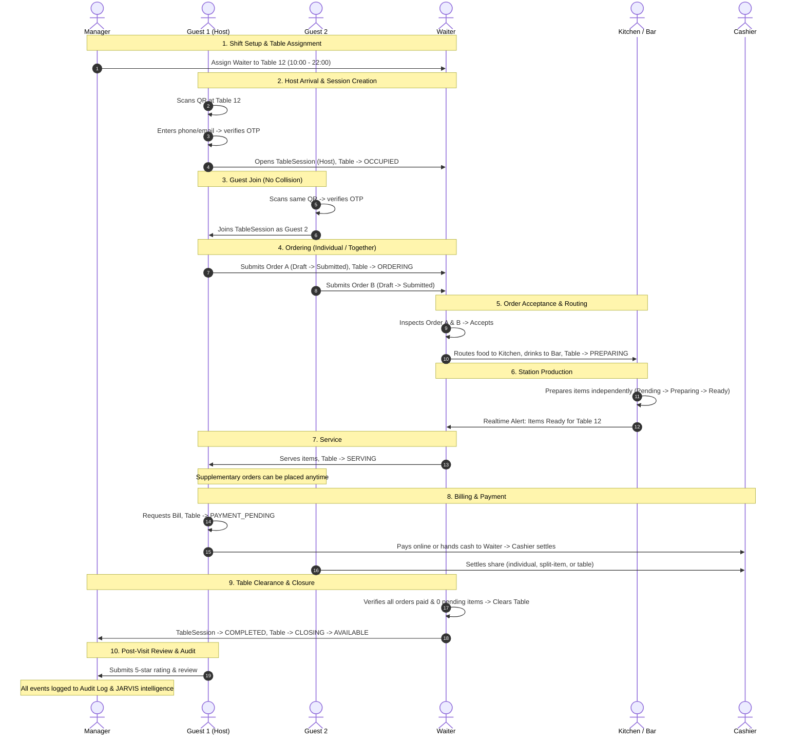

# Tavonza AI — Core Application & Operational Flow Specification

Role-by-role operational flow, based on the confirmed architecture (multi-brand hierarchy, multi-guest table sessions, configurable order acceptance, granular manager permissions) and the Drizzle database schema.

---

## 1. Role Hierarchy & Data Model Mapping

Tavonza has two distinct tiers of users: **platform-level users** (not tied to one branch) and **branch-level staff** (tied to one or more branches via a `StaffAssignment`). The hierarchy maps onto the schema as follows:

| Role (Business Term) | Data Model Representation | Operational Scope |
| :--- | :--- | :--- |
| **Super Admin** | `GlobalRole.SUPER_ADMIN` (platform/support account) | Cross-organization, cross-restaurant. Not tied to any single client. |
| **Admin / Owner** | `GlobalRole.ADMIN` / `RESTAURANT_OWNER`, owns an `Organization` | All brands (Restaurants) and branches under their Organization. |
| **Regional Manager** | `StaffAssignment` with role `BRANCH_MANAGER`, repeated across several `Branch` records (one assignment row per branch), full permission set on each | Every branch they are assigned to, within one restaurant/brand. |
| **Assistant Manager** | `StaffAssignment` with role `BRANCH_MANAGER` at a single branch, with a reduced `permissions[]` template (e.g. no staff creation / no branch settings) | One branch, subset of manager permissions. |
| **Waiter** | `StaffAssignment` role `WAITER` + time-bound `WaiterTableAssignment` | Tables assigned to them for their active session window, at one branch. |
| **Bartender** | `StaffAssignment` role `BARTENDER` | Order items where `stationType = 'BAR'`, at one branch. |
| **Kitchen** | `StaffAssignment` role `KITCHEN_STAFF` | Order items where `stationType = 'KITCHEN'`, at one branch. |
| **Cashier** | `StaffAssignment` role `CASHIER` | Payment settlement for orders at one branch (limited order view). |
| **Customer** | `GlobalRole.CUSTOMER`, represented per visit as a `GuestSession` | Their own guest session inside one table session (or a takeaway/delivery order with no table). |

> [!NOTE]
> **Architectural Note on Regional Manager / Assistant Manager / General Manager / Shift Manager:**
> In the database schema, the `staffRoleEnum` contains one manager-type value (`BRANCH_MANAGER`). The multiple managerial titles requested (General Manager, Regional Manager, Assistant Manager, Shift Manager) are **not separate enum values** — they are the same `BRANCH_MANAGER` role instantiated with different `permissions[]` templates and, for a Regional Manager, multiple `StaffAssignment` rows (one per branch they oversee). This keeps the permission system the single source of truth instead of hard-coding a fixed bundle per title.

---

## 2. Roles & Permissions Matrix

| Action | Super Admin | Admin / Owner | Regional Mgr | Assistant Mgr | Waiter | Bartender | Kitchen | Cashier |
| :--- | :---: | :---: | :---: | :---: | :---: | :---: | :---: | :---: |
| **Create/support client Organizations** | ✅ | — | — | — | — | — | — | — |
| **Create Brands / Restaurants** | ✅ | ✅ | — | — | — | — | — | — |
| **Create Branches** | ✅ | ✅ | — | — | — | — | — | — |
| **Create Managers (any title)** | ✅ | ✅ | Configurable | — | — | — | — | — |
| **Create branch staff (Waiter/Kitchen/Bar/Cashier/Host)** | ✅ | ✅ | ✅ *(overseen)* | ✅ *(own branch)* | — | — | — | — |
| **Create Tables / QR codes** | — | ✅ | ✅ | ✅ | — | — | — | — |
| **Assign Waiter-to-Table sessions** | — | ✅ | ✅ | ✅ | — | — | — | — |
| **Configure branch settings (acceptance, tax, etc.)** | — | ✅ | ✅ *(if granted)* | Template | — | — | — | — |
| **Manage menu & pricing** | — | ✅ | ✅ *(if granted)* | Template | — | Availability | Availability | — |
| **Accept/reject customer order** | — | ✅ *(backup)* | ✅ *(backup)* | ✅ *(backup)* | ✅ *(primary)* | — | — | — |
| **Update item status (preparing/ready/unavailable)** | — | — | — | — | — | ✅ *(bar)* | ✅ *(kitchen)* | — |
| **Serve items / clear table** | — | — | — | — | ✅ | — | — | — |
| **Process / settle payment** | — | ✅ | ✅ | ✅ *(if granted)* | Collects only | — | — | ✅ |
| **Apply discounts** | — | ✅ | ✅ *(if granted)* | Per grant | Per grant | — | — | Per grant |
| **Approve refunds** | ✅ | ✅ | ✅ *(if granted)* | Per grant | — | — | — | — |
| **View reports** | Platform | ✅ *(all)* | ✅ *(overseen)* | ✅ *(own)* | — | — | — | Limited |
| **Access customer sales / PII** | Logged | ✅ | ✅ *(branches)* | Limited | — | — | — | Operational |

Every cell beyond the fixed defaults can be individually adjusted through the granular `permissionActionEnum` grant system on a `StaffAssignment` (`MANAGE_MENU`, `MANAGE_TABLES`, `MANAGE_STAFF`, `MANAGE_RESERVATIONS`, `VIEW_ORDERS`, `UPDATE_ORDER_STATUS`, `MANAGE_PAYMENTS`, `APPLY_DISCOUNTS`, `VIEW_REPORTS`, `MANAGE_BRANCH_SETTINGS`). This makes "Regional Manager" and "Assistant Manager" configurable starting templates rather than rigid walls.

---

## 3. Role-by-Role Operational Flow

### 3.1 Super Admin
A platform/support-team account, not tied to any one restaurant. Used for onboarding new clients and providing technical support — never for placing orders or representing a restaurant.
1. Logs into the platform-level console (outside any single Organization context).
2. Creates a new client `Organization` record and its initial owner `Admin` account, or is invited into an existing Organization for a support ticket.
3. Access to any one client's sales or customer data is permission-based, logged, and time-limited. Super Admin does not receive standing, unrestricted access to a restaurant's data by default.
4. Views platform-wide health and operational metrics, but does not participate in the day-to-day restaurant flow (ordering, kitchen, payments).
5. Every access event by a Super Admin against a client Organization is written to that Organization's `audit_logs`.

### 3.2 Admin / Owner
Owns the Organization. Full administrative control across every Brand and Branch under it.
1. Creates one or more Brands (`restaurants`) under their Organization.
2. Within each Brand, creates one or more `branches`, each with its own menu, employees, tables, stations, inventory, suppliers, operating hours, reservations, and branch settings.
3. Creates manager accounts and decides each manager's title/template (General Manager, Regional Manager, Assistant Manager, Shift Manager) and which branch(es) they are assigned to — a branch is never hard-restricted to exactly one manager.
4. Configures each branch's `branch_settings`:
   - Order acceptance mode: `AUTO_ACCEPT`, `WAITER_APPROVAL`, or `MANAGER_APPROVAL`.
   - Tax rate, service charge rate, currency.
   - Unavailable menu items display: hidden or shown disabled/greyed-out.
   - Multi-guest table session behavior: `requireOtpPerGuest`, allow split-bill.
5. Views consolidated cross-brand, cross-branch reporting (sales, orders, staff performance) and can drill into any single branch.
6. Has full override authority at any order stage, including post-payment refunds, and can override a cancellation after kitchen/bar preparation has already started.
7. Reviews Manager/Owner-level JARVIS intelligence: what is happening across the business and what requires attention.
8. Every discount, refund, price override, table reassignment, stock correction, permission change, employee creation/deletion, manual order modification, and manager override anywhere under the Organization is written to the immutable `audit_logs` (who, what, when, where, and why).

### 3.3 Regional Manager
Oversees more than one branch within a brand (the multi-branch manager tier). Implemented as one `BRANCH_MANAGER`-role `StaffAssignment` per branch they cover, each carrying the same or a tailored permission set.
1. Assigned by the Admin to two or more branches under the same brand.
2. Within each assigned branch, possesses the same operational authority as a single-branch manager: create employee accounts (Waiter, Kitchen, Bartender, Cashier, Host), create/regenerate table QR codes, create waiter-to-table session assignments, configure branch settings (if granted), manage menu catalog (if granted).
3. Can accept or reject orders directly as a backup at any assigned branch when no waiter is available.
4. Views a rolled-up report across just the branches they oversee (a tailored slice of the Admin dashboard).
5. Overrides cancellations/refunds at the branch level for any branch they are assigned to.
6. Can grant one additional permission at a time to a specific staff member at any of their branches (e.g. permitting a trusted Waiter to apply discounts) without changing that staff member's overall role.
7. Cannot create new branches, new brands, or other managers unless the Admin has explicitly extended that permission (branch/manager creation defaults to Admin-only).

### 3.4 Assistant Manager
A single-branch manager title with a reduced default permission template — a starting point the Admin or Regional Manager can adjust permission-by-permission.
1. Assigned to exactly one branch.
2. Default template covers: create and manage employee accounts for that branch, manage waiter-to-table assignments, view branch orders and reports, accept orders as backup.
3. Default exclusions: branch settings changes (order acceptance mode, tax rates), full refund authority, or the ability to create other managers (these can be added individually if needed).
4. Functions as the on-shift decision-maker for operational exceptions that front-line staff cannot resolve: approving order rejections, stepping in as Manager Approval on the order-acceptance workflow, and authorizing mid-preparation cancellations.

### 3.5 Waiter
Serves an assigned set of tables during a defined, time-bound session — not a fixed, permanent table mapping.
1. Assigned to a set of tables for a session window by a Manager (e.g. Tables 1–3, 10 PM–10 AM). A table cannot be double-assigned to two waiters for overlapping windows — the system validates this at assignment time.
2. Receives incoming orders for their assigned tables' active sessions via real-time WebSocket feeds.
3. For each order: Accepts or Rejects it (unless the branch's acceptance mode is `AUTO_ACCEPT` or `MANAGER_APPROVAL`). On rejection, selects a predefined reason code (`ITEM_UNAVAILABLE`, `KITCHEN_CAPACITY`, `MODIFICATION_IMPOSSIBLE`, `ALLERGY_CONCERN`, `RESTAURANT_CLOSING`, `OTHER`) plus an optional note; the customer sees the reason and can modify and resubmit.
4. Once accepted, the order routes automatically to Kitchen and/or Bar based on each item's station type (`stationType`).
5. Receives notifications as each item is marked `READY`, collects it from the station, and serves the customer.
6. Can cancel an order outright only before kitchen/bar preparation has started; after that, cancellation authority moves to Kitchen/Bartender (item-level) or Manager (order-level override).
7. For offline payment: collects cash/card from the table and delivers it to the Cashier, who settles the order against its order number. For online payment: the customer pays directly and the Waiter sees the order updated to `PAID`.
8. Marks a table `AVAILABLE` (cleared) only once every order tied to that table session — including supplementary orders placed later by any guest — is fully paid and has no pending kitchen/bar items. This closes the `TableSession` (`COMPLETED`) and resets the table status.
9. Under the multi-guest table model: any guest at the table can add to the shared order, and the Waiter's view shows the table session as a whole, with each guest's own items and payment status visible underneath it.

### 3.6 Bartender
Prepares beverage items only; shares the underlying station routing architecture with Kitchen, but operates with a dedicated role, login, and interface.
1. Sees only order items where `stationType = 'BAR'`, filtered to their branch, the moment an order is confirmed.
2. Transitions each item independently through its lifecycle: `PENDING` → `PREPARING` → `READY` (or `UNAVAILABLE` with a reason code if an ingredient has depleted mid-service).
3. Marking an item `READY` notifies the assigned Waiter to collect and serve it — items are tracked and served individually, not as an atomic whole-order block.
4. Controls operational availability of beverage menu items (`isAvailable` toggle / 86'd), but does not modify prices.
5. Marking an item unavailable after preparation has started counts as that item's own item-level cancellation; it never cancels the remainder of the order.

### 3.7 Kitchen
Prepares food items; mirrors the Bartender flow on the food side of the station split.
1. Sees only order items where `stationType = 'KITCHEN'`, filtered to their branch, once an order is confirmed.
2. Moves each item through `PENDING` → `PREPARING` → `READY` (or `UNAVAILABLE` with a reason).
3. Marking an item `READY` notifies the Waiter for collection and service.
4. Controls operational availability of food menu items (Available / Unavailable / 86'd); does not set prices unless separately authorized.
5. Where recipe-level inventory is configured, selling a menu item reduces theoretical ingredient stock automatically.

### 3.8 Cashier
Handles offline/in-person payment settlement at one branch, with a deliberately limited order view.
1. Sees, per order: order number, table, items, subtotal, taxes, discounts, tips, total, amount already paid, outstanding amount, payment method, and payment status. Full customer PII is masked unless operationally required and permitted.
2. Receives cash/card handed over by the Waiter (for dine-in) or settles directly with a walk-in/takeaway customer.
3. Settles payment against an order number, recording `paymentMethod` and updating `paymentStatus`. Because payment scope can be an order, selected items, one guest's tab, or an entire table session, the Cashier's settlement screen supports settling any of these scopes (`paymentScopeEnum`).
4. For an online payment refund, where technically supported, the refund returns through the original payment gateway automatically; every refund — online or offline — creates an audit entry with the original transaction, refund amount, reason, employee, permission level, timestamp, and approval metadata.
5. Does not accept or reject orders, and does not manage the menu catalog.

### 3.9 Customer
Authenticates per table/session (or per takeaway/delivery order), browses, orders, and pays — potentially as one of several guests sharing a table.
1. Scans the table's QR code → lands on the ordering web application pre-loaded with branch and table context, not yet authenticated. (The QR code only encodes the opaque table QR token and branch ID; it is never used for authentication.)
2. Enters email or phone number → receives an OTP → verifies it. This creates an authenticated `GuestSession` bound to that table's `TableSession`.
3. If no `TableSession` is active on that table, verifying the OTP opens a new one and the guest becomes the `isHostGuest`.
4. If a `TableSession` is already active (another guest previously scanned and joined), the new guest joins it as an additional `GuestSession` — the system never blocks a second scan with "table occupied."
5. Browses the menu; unavailable items are either hidden or shown disabled, per the branch's configuration.
6. Adds items to cart and chooses the ordering mode:
   - **Order individually:** Each guest's order is recorded under their own `GuestSession` — fully independent tabs.
   - **Order together:** One shared cart, recorded against whichever guest's device placed it, but understood as belonging to the whole table.
7. Selects required/optional modifiers (size, spice level, add-ons); the exact choices and resulting price are snapshotted into the order at placement time and never change, even if the menu item price changes later.
8. Order routes to the assigned Waiter (or auto-accepts, or routes to Manager) for Accept/Reject.
9. If rejected, sees the specific reason and can modify and resubmit immediately.
10. If accepted, may pay instantly online or wait and pay once served.
11. Can order again later in the same visit — supplementary orders attach to the same `TableSession`.
12. Can leave early — the table stays open for the rest of the group as long as any `GuestSession` under it remains active and unsettled.
13. Pays in whichever way fits the group:
    - Pay for just themselves (`GUEST_SESSION`).
    - Pay for another specific guest (`GUEST_SESSION`).
    - Pay for the entire table at once (`TABLE_SESSION`).
    - Split a shared order unevenly by item (`ORDER_ITEMS`) — "I had the calamari, you had the steak."
14. The `TableSession` only fully closes once every guest at the table has settled their balance and there are no pending kitchen/bar items.
15. After the visit, can leave a 1–5 star rating and optional review; reviews are subject to platform moderation targeting spam, abuse, and fraud only.
16. Over time, builds a dining profile (favourite dishes, allergies, average spend) that JARVIS draws on for personalized dining recommendations.

---

## 4. End-to-End Cross-Role Flow (One Full Table Visit)



### Flow Breakdown
1. **Table Setup:** Branch, tables, QR codes, menu, and staff exist; a Manager creates a `WaiterTableAssignment` covering the current shift window.
2. **Guest 1 Arrives:** Scans QR at Table 12 → enters phone/email → OTP verified → opens a new `TableSession`, becomes `isHostGuest`, table status moves `AVAILABLE` → `OCCUPIED`.
3. **Guests 2–4 Arrive:** Each scans the same QR (or uses a join code) → OTP-verifies → joins as an additional `GuestSession` on the same `TableSession` — zero "table occupied" blockage.
4. **Ordering:** Guests order individually and/or together; table status moves to `ORDERING` while a cart is being built or an order is awaiting acceptance.
5. **Acceptance:** Each order is accepted or rejected by the assigned Waiter (or Auto/Manager per branch setting). On acceptance, table status moves to `PREPARING` and items route to Kitchen and/or Bar by station type.
6. **Preparation:** Each item moves `PENDING` → `PREPARING` → `READY` (or `UNAVAILABLE`), tracked independently per item.
7. **Serving:** Waiter collects ready items and serves them; table status moves to `SERVING`. Additional orders from any guest can be placed and follow the same acceptance → preparation → serving path while the table remains open.
8. **Billing:** Once items are served, the table moves toward `PAYMENT_PENDING`. Payment occurs online instantly per order, or offline through Waiter → Cashier hand-off, supporting individual, together, split-by-item, or pay-for-another.
9. **Closing:** Once every guest's balance is settled and no kitchen/bar items remain pending, the Waiter marks the table clear; table status moves `PAYMENT_PENDING` → `CLOSING` → `AVAILABLE`, and `TableSession` status moves to `COMPLETED`.
10. **After Visit:** The customer can review the dining experience; all status transitions, discounts, and payments reside in the immutable Audit Log; JARVIS feeds role-specific operational insights back to staff.

---

## 5. Key State Machines (Independent of Each Other)

The platform deliberately decouples business state machines so that line items, orders, tables, and sessions can progress asynchronously without blocking one another.

```text
Table (Service Status):
AVAILABLE ──► OCCUPIED ──► ORDERING ──► PREPARING ──► SERVING ──► PAYMENT_PENDING ──► CLOSING ──► AVAILABLE

Table Session:
ACTIVE ──► BILL_REQUESTED ──► CLOSING ──► COMPLETED
  │
  └─────────────────────────────────────► ABANDONED (Idle Timeout)

Guest Session:
ACTIVE ──► LEFT / CLOSED

Order:
PENDING ──► CONFIRMED ──► PREPARING ──► READY ──► SERVED ──► COMPLETED
  │             │
  │             └────────► CANCELLED (Pre-prep)
  └──────────────────────► REJECTED (With Reason)

Order Item:
PENDING ──► PREPARING ──► READY ──► SERVED
  │             │
  └─────────────┴────────► UNAVAILABLE (86'd / Reason) / CANCELLED

Payment:
UNPAID ──► PARTIALLY_PAID ──► PAID
  │                             │
  └────────► FAILED             └────────► REFUNDED

Reservation:
PENDING ──► CONFIRMED ──► SEATED ──► COMPLETED
  │             │
  └─────────────┴────────► CANCELLED / NO_SHOW
```

### State Machine Independence Invariants
- **Multi-Order Coexistence:** One table can have `Order A = SERVED`, `Order B = PREPARING`, and `Order C = PAYMENT_PENDING` while the overall `TableSession` is still `ACTIVE`.
- **Item-Level Independence:** In a single order, Item 1 (Kitchen) can be `READY` while Item 2 (Bar) is `PREPARING` and Item 3 is `UNAVAILABLE`. Marking Item 3 unavailable never cancels Items 1 or 2.
- **Session Closure Gate:** A `TableSession` cannot transition to `COMPLETED` if any associated order has unpaid balances or if any order item is in `PENDING` or `PREPARING` status.
- **Table Clearance Gate:** A `Table` cannot return to `AVAILABLE` until its active `TableSession` has reached `COMPLETED` or `ABANDONED`.

---

## 6. Invariants & Business Rules

1. **Transactional Outbox for All Events:** Every business state mutation must write an outbox event in the same PostgreSQL transaction. Real-time WebSockets and workers are downstream subscribers, not the source of truth.
2. **Capability-Based Security:** UI elements, menu items, order acceptance, discounts, and refunds must be gated by backend permission and scope checks (`Actor + Permission + Scope + Resource`).
3. **Tenant & Branch Isolation:** Every query and mutation enforces mandatory Organization and Branch scoping derived from validated JWT context, never from client-supplied request bodies.
4. **Price Snapshotting:** Menu items and modifiers snapshot their unit price, tax rate, and names onto the `OrderItem` at creation time. Subsequent menu price updates never alter past or active orders.
5. **No Blind Role Checks:** "Regional Manager" and "Assistant Manager" are configurable permission bundles over `BRANCH_MANAGER`, not rigid code-level branching.
