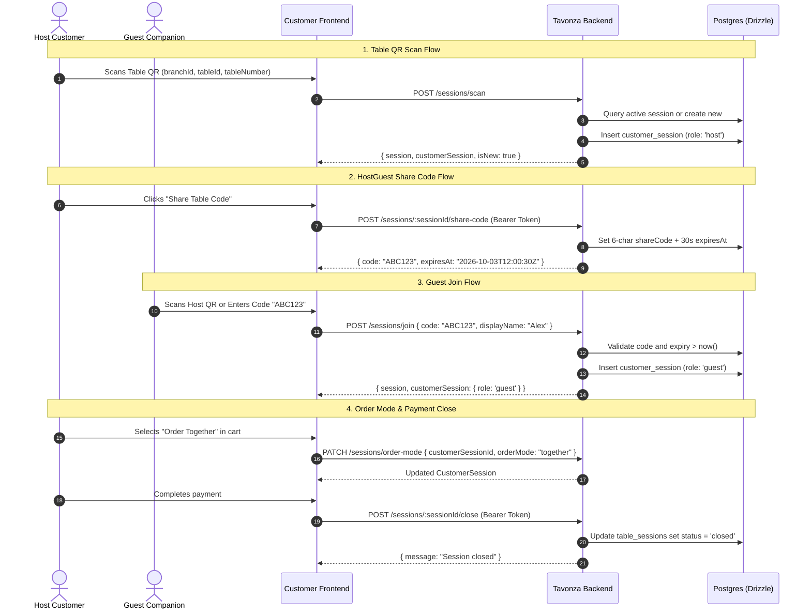

# Tavonza Customer Table Sessions API & Frontend Integration Guide

> **Module**: Customer | Sessions  
> **Backend Controller**: [`TableSessionController`](file:///c:/Users/MD_Kayesur/Desktop/All_web/tavonzaai/apps/api/src/modules/table-sessions/presentation/table-session.controller.ts)  
> **Backend Service**: [`TableSessionService`](file:///c:/Users/MD_Kayesur/Desktop/All_web/tavonzaai/apps/api/src/modules/table-sessions/application/services/table-session.service.ts)  
> **Database Schema**: [`session.schema.ts`](file:///c:/Users/MD_Kayesur/Desktop/All_web/tavonzaai/packages/database/src/schema/session.schema.ts)  
> **Frontend Feature**: [`sessionApi.ts`](file:///c:/Users/MD_Kayesur/Desktop/All_web/tavonzaai/frontend/customer/src/redux/features/sessionApi.ts)  
> **Frontend Redux Slice**: [`sessionSlice.ts`](file:///c:/Users/MD_Kayesur/Desktop/All_web/tavonzaai/frontend/customer/src/redux/slices/sessionSlice.ts)  
> **Live API Base URL**: `https://prod-api.tavonza.com`

---

## 1. Architecture & Lifecycle Overview

The Table Sessions module manages the complete dining lifecycle for in-restaurant customers:
1. **Table QR Scan**: Customer scans the physical table QR code (`POST /sessions/scan`). An active table session is created or returned.
2. **Host vs Guest Role**: The first authenticated customer who scans becomes the **Host**.
3. **HostGuest Feature**: The host can generate a temporary 6-character share code or QR (`POST /sessions/:sessionId/share-code`) with a **30-second expiry**.
4. **Guest Joining**: Dining companions scan the host's QR or type the 6-character code (`POST /sessions/join`) to join the same table session.
5. **Guest List Sync**: Any participant can retrieve table details and the list of joined guests (`GET /sessions/:sessionId`).
6. **Order Mode Selection**: Customers can choose whether they order individually or together (`PATCH /sessions/order-mode`).
7. **Session Close**: When dining and payment are complete, the session is closed (`POST /sessions/:sessionId/close`).



---

## 2. API Endpoints Specification

### 1. `POST /sessions/scan`
Scan table QR code — creates a new dining session or joins an active table session.

- **Endpoint**: `/sessions/scan`
- **Method**: `POST`
- **Auth**: Optional `Bearer <access_token>`. If authenticated, the backend automatically attaches `userId` and assigns `role: 'host'` (if new) or creates/fetches the user's `customerSession`.
- **Request Headers**:
  ```http
  Content-Type: application/json
  Authorization: Bearer <access_token> (Optional)
  ```
- **Request Body (JSON)**:
  ```json
  {
    "branchId": "e3b0c442-98fc-1c14-9afb-4c8996fb9242",
    "tableId": "c8d2011b-3f62-4217-90c7-cb1a74288001",
    "tableNumber": "Table 08"
  }
  ```
- **Validation Rules**:
  - `branchId`: Valid UUID (required)
  - `tableId`: Valid UUID (required)
  - `tableNumber`: Non-empty string (required)
- **Response `201 Created`**:
  ```json
  {
    "session": {
      "id": "7b587a89-0be3-4886-9a25-c6be938148b4",
      "branchId": "e3b0c442-98fc-1c14-9afb-4c8996fb9242",
      "tableId": "c8d2011b-3f62-4217-90c7-cb1a74288001",
      "tableNumber": "Table 08",
      "status": "active",
      "shareCode": null,
      "shareCodeExpiresAt": null,
      "openedAt": "2026-10-03T08:30:00.000Z",
      "closedAt": null
    },
    "customerSession": {
      "id": "9d1348aa-4762-4df4-8e31-89d1b11f4201",
      "tableSessionId": "7b587a89-0be3-4886-9a25-c6be938148b4",
      "userId": "fa3b2110-863a-4467-b50a-9d21cb73b110",
      "displayName": null,
      "role": "host",
      "orderMode": "individual",
      "joinedAt": "2026-10-03T08:30:00.000Z",
      "leftAt": null
    },
    "isNew": true
  }
  ```
- **Error Codes**:
  - `400 Bad Request`: When fields fail UUID format or are missing.

---

### 2. `GET /sessions/:sessionId`
Retrieve table session details and list of all joined customers / guests.

- **Endpoint**: `/sessions/:sessionId`
- **Method**: `GET`
- **Auth**: None (Public for customers at the table)
- **Path Parameters**:
  - `sessionId`: UUID string
- **Response `200 OK`**:
  ```json
  {
    "session": {
      "id": "7b587a89-0be3-4886-9a25-c6be938148b4",
      "branchId": "e3b0c442-98fc-1c14-9afb-4c8996fb9242",
      "tableId": "c8d2011b-3f62-4217-90c7-cb1a74288001",
      "tableNumber": "Table 08",
      "status": "active",
      "shareCode": "A8K9Z2",
      "shareCodeExpiresAt": "2026-10-03T08:31:00.000Z",
      "openedAt": "2026-10-03T08:30:00.000Z",
      "closedAt": null
    },
    "customers": [
      {
        "id": "9d1348aa-4762-4df4-8e31-89d1b11f4201",
        "tableSessionId": "7b587a89-0be3-4886-9a25-c6be938148b4",
        "userId": "fa3b2110-863a-4467-b50a-9d21cb73b110",
        "displayName": "John Doe",
        "role": "host",
        "orderMode": "individual",
        "joinedAt": "2026-10-03T08:30:00.000Z",
        "leftAt": null
      },
      {
        "id": "f51b4122-381c-4b53-a7ee-001a1829e123",
        "tableSessionId": "7b587a89-0be3-4886-9a25-c6be938148b4",
        "userId": null,
        "displayName": "Alex",
        "role": "guest",
        "orderMode": "individual",
        "joinedAt": "2026-10-03T08:32:15.000Z",
        "leftAt": null
      }
    ]
  }
  ```
- **Error Codes**:
  - `404 Not Found`: `"Session not found"` if the sessionId does not exist in the database.

---

### 3. `POST /sessions/:sessionId/share-code`
Generates a 6-character alphanumeric share code with a **30-second expiry** and updates the table session.

- **Endpoint**: `/sessions/:sessionId/share-code`
- **Method**: `POST`
- **Auth**: **Required** `Bearer <access_token>` (`JwtAuthGuard`)
- **Path Parameters**:
  - `sessionId`: UUID string
- **Request Headers**:
  ```http
  Authorization: Bearer <access_token>
  ```
- **Response `200 OK`**:
  ```json
  {
    "code": "KM7P4Q",
    "expiresAt": "2026-10-03T08:35:30.000Z"
  }
  ```
- **Notes**:
  - Code is 6 characters alphanumeric uppercase (e.g. `KM7P4Q`).
  - `expiresAt` is set to exactly `Date.now() + 30 * 1000` (30 seconds), matching the Figma UI countdown timer (`00:30sec`).
- **Error Codes**:
  - `401 Unauthorized`: Missing or invalid Bearer token.
  - `404 Not Found`: `"Session not found"`.

---

### 4. `POST /sessions/join`
Allows a dining guest to join an active table session using the host's 6-character share code.

- **Endpoint**: `/sessions/join`
- **Method**: `POST`
- **Auth**: Optional `Bearer <access_token>`. If authenticated, `userId` is linked to the customer session.
- **Request Body (JSON)**:
  ```json
  {
    "code": "KM7P4Q",
    "displayName": "Sarah"
  }
  ```
- **Validation Rules**:
  - `code`: Non-empty string (case-insensitive on client, uppercase on backend)
  - `displayName`: Optional string
- **Response `200 OK`**:
  ```json
  {
    "session": {
      "id": "7b587a89-0be3-4886-9a25-c6be938148b4",
      "branchId": "e3b0c442-98fc-1c14-9afb-4c8996fb9242",
      "tableId": "c8d2011b-3f62-4217-90c7-cb1a74288001",
      "tableNumber": "Table 08",
      "status": "active"
    },
    "customerSession": {
      "id": "9812ccf1-28fa-4e78-bf89-e18e8749a200",
      "tableSessionId": "7b587a89-0be3-4886-9a25-c6be938148b4",
      "userId": null,
      "displayName": "Sarah",
      "role": "guest",
      "orderMode": "individual",
      "joinedAt": "2026-10-03T08:35:10.000Z",
      "leftAt": null
    }
  }
  ```
- **Error Codes**:
  - `400 Bad Request`: `"Invalid or expired share code"` if code does not match or `shareCodeExpiresAt < now()`.
  - `409 Conflict`: `"You are already part of this table session"` if the logged-in user is already in this session.

---

### 5. `PATCH /sessions/order-mode`
Toggle order mode between `'individual'` (each person pays for their own items) and `'together'` (combined order/bill).

- **Endpoint**: `/sessions/order-mode`
- **Method**: `PATCH`
- **Auth**: None
- **Request Body (JSON)**:
  ```json
  {
    "customerSessionId": "9d1348aa-4762-4df4-8e31-89d1b11f4201",
    "orderMode": "together"
  }
  ```
- **Validation Rules**:
  - `customerSessionId`: Valid UUID (required)
  - `orderMode`: Must be `'individual'` or `'together'`
- **Response `200 OK`**:
  ```json
  {
    "id": "9d1348aa-4762-4df4-8e31-89d1b11f4201",
    "tableSessionId": "7b587a89-0be3-4886-9a25-c6be938148b4",
    "userId": "fa3b2110-863a-4467-b50a-9d21cb73b110",
    "displayName": null,
    "role": "host",
    "orderMode": "together",
    "joinedAt": "2026-10-03T08:30:00.000Z",
    "leftAt": null
  }
  ```
- **Error Codes**:
  - `400 Bad Request`: If `orderMode` is not `'individual'` or `'together'`, or if `customerSessionId` is not a UUID.
  - `404 Not Found`: `"Customer session not found"`.

---

### 6. `POST /sessions/:sessionId/close`
Closes the table session after payment is completed.

- **Endpoint**: `/sessions/:sessionId/close`
- **Method**: `POST`
- **Auth**: **Required** `Bearer <access_token>` (`JwtAuthGuard`)
- **Path Parameters**:
  - `sessionId`: UUID string
- **Request Headers**:
  ```http
  Authorization: Bearer <access_token>
  ```
- **Response `200 OK`**:
  ```json
  {
    "message": "Session closed"
  }
  ```
- **Error Codes**:
  - `401 Unauthorized`: Missing or invalid token.

---

## 3. Redux Store & Feature Implementation

The feature is implemented in `frontend/customer` under:
- **API & Async Thunks**: [`sessionApi.ts`](file:///c:/Users/MD_Kayesur/Desktop/All_web/tavonzaai/frontend/customer/src/redux/features/sessionApi.ts)
- **Slice & State Reducer**: [`sessionSlice.ts`](file:///c:/Users/MD_Kayesur/Desktop/All_web/tavonzaai/frontend/customer/src/redux/slices/sessionSlice.ts)
- **Store Registered**: [`store.ts`](file:///c:/Users/MD_Kayesur/Desktop/All_web/tavonzaai/frontend/customer/src/redux/store.ts)
- **Live Health Checker**: [`sessionBackendChecker.ts`](file:///c:/Users/MD_Kayesur/Desktop/All_web/tavonzaai/frontend/customer/src/redux/features/sessionBackendChecker.ts)

### Redux State Shape:
```typescript
interface SessionState {
  currentSession: TableSession | null;
  customerSession: CustomerSession | null;
  guests: CustomerSession[];
  shareCode: { code: string; expiresAt: string } | null;
  isNewSession: boolean;
  orderMode: 'individual' | 'together';
  isLoading: boolean;
  isGeneratingCode: boolean;
  isJoining: boolean;
  error: string | null;
  shareCodeError: string | null;
}
```

---

## 4. Frontend Integration Guide

Here is where each API should be integrated into the Customer Next.js application:

### Point 1: Table QR Scan Screen (`/scan`)
**Target File**: [`frontend/customer/src/app/scan/page.tsx`](file:///c:/Users/MD_Kayesur/Desktop/All_web/tavonzaai/frontend/customer/src/app/scan/page.tsx)  
**When to call**: When customer opens a QR code link (e.g., `https://tavonza.com/scan?branchId=...&tableId=...&table=Table%2008`).

```tsx
import { useAppDispatch } from '@/redux/store';
import { scanTableQr } from '@/redux/features/sessionApi';

// Inside component:
useEffect(() => {
  const branchId = searchParams.get('branchId');
  const tableId = searchParams.get('tableId');
  const tableNumber = searchParams.get('table') || 'Table 08';

  if (branchId && tableId) {
    dispatch(scanTableQr({ branchId, tableId, tableNumber })).unwrap()
      .then((res) => {
        // Redirect to welcome or menu page with table info
        router.replace(`/welcome?table=${encodeURIComponent(res.session.tableNumber)}`);
      })
      .catch((err) => {
        console.error('Scan error:', err);
      });
  }
}, []);
```

---

### Point 2: Splash & Table Header (`/welcome` & `/menu`)
**Target File**: [`frontend/customer/src/app/welcome/page.tsx`](file:///c:/Users/MD_Kayesur/Desktop/All_web/tavonzaai/frontend/customer/src/app/welcome/page.tsx) and Header component.  
**When to call**: To display table number, host status, and the list of guests seated at the table.

```tsx
import { useAppDispatch, useAppSelector } from '@/redux/store';
import { fetchTableSession } from '@/redux/features/sessionApi';

const { currentSession, guests } = useAppSelector((state) => state.session);

useEffect(() => {
  if (currentSession?.id) {
    dispatch(fetchTableSession(currentSession.id));
  }
}, [currentSession?.id]);
```

---

### Point 3: Host Share Code Modal (HostGuest Feature)
**Target File**: A new component `src/components/HostShareCodeModal.tsx` or Header dropdown button.  
**When to call**: When Host clicks **"Invite Friends / Share Code"**. Displays the 6-character code and QR with a 30-second countdown.

```tsx
import { useAppDispatch, useAppSelector } from '@/redux/store';
import { generateHostShareCode } from '@/redux/features/sessionApi';
import { clearShareCode } from '@/redux/slices/sessionSlice';

function ShareCodeDialog({ sessionId }: { sessionId: string }) {
  const dispatch = useAppDispatch();
  const { shareCode, isGeneratingCode } = useAppSelector((state) => state.session);
  const [secondsLeft, setSecondsLeft] = useState(30);

  const handleGenerate = () => {
    dispatch(generateHostShareCode(sessionId));
    setSecondsLeft(30);
  };

  useEffect(() => {
    if (!shareCode) return;
    const timer = setInterval(() => {
      setSecondsLeft((prev) => {
        if (prev <= 1) {
          clearInterval(timer);
          dispatch(clearShareCode());
          return 0;
        }
        return prev - 1;
      });
    }, 1000);
    return () => clearInterval(timer);
  }, [shareCode]);

  return (
    <div className="p-4 bg-zinc-900 border border-neutral-800 rounded-xl text-center">
      <h3 className="font-semibold text-lg text-white">Share Table Code</h3>
      {shareCode ? (
        <div className="mt-3">
          <div className="text-3xl font-mono font-bold tracking-widest text-amber-400">
            {shareCode.code}
          </div>
          <p className="text-xs text-neutral-400 mt-1">
            Expires in 00:{secondsLeft.toString().padStart(2, '0')}s
          </p>
        </div>
      ) : (
        <button
          onClick={handleGenerate}
          disabled={isGeneratingCode}
          className="mt-3 px-4 py-2 bg-amber-400 text-black font-semibold rounded-lg"
        >
          {isGeneratingCode ? 'Generating...' : 'Generate 30s Code'}
        </button>
      )}
    </div>
  );
}
```

---

### Point 4: Guest Join Modal (`/join` or Banner)
**Target File**: Modal or dedicated page `src/app/join/page.tsx`.  
**When to call**: When a guest companion scans the host's QR or inputs the 6-character code.

```tsx
import { useAppDispatch } from '@/redux/store';
import { joinTableSession } from '@/redux/features/sessionApi';

function JoinTableForm() {
  const [code, setCode] = useState('');
  const [displayName, setDisplayName] = useState('');
  const dispatch = useAppDispatch();

  const handleJoin = async () => {
    try {
      const res = await dispatch(joinTableSession({ code, displayName })).unwrap();
      // On success: redirect to menu
      router.push(`/menu?table=${encodeURIComponent(res.session.tableNumber)}&guest=true`);
    } catch (err: any) {
      alert(err || 'Invalid or expired share code');
    }
  };

  return (
    <div className="p-6 bg-zinc-950 rounded-2xl border border-neutral-800">
      <input
        type="text"
        placeholder="Enter 6-char Host Code"
        maxLength={6}
        value={code}
        onChange={(e) => setCode(e.target.value.toUpperCase())}
        className="w-full text-center text-2xl tracking-widest uppercase p-3 bg-zinc-900 rounded-lg text-white border border-neutral-700"
      />
      <input
        type="text"
        placeholder="Your Name (optional)"
        value={displayName}
        onChange={(e) => setDisplayName(e.target.value)}
        className="w-full mt-3 p-3 bg-zinc-900 rounded-lg text-white border border-neutral-700"
      />
      <button
        onClick={handleJoin}
        className="w-full mt-4 py-3 bg-amber-400 text-black font-bold rounded-lg"
      >
        Join Table
      </button>
    </div>
  );
}
```

---

### Point 5: Cart & Checkout Order Mode Selection
**Target File**: [`frontend/customer/src/app/cart/page.tsx`](file:///c:/Users/MD_Kayesur/Desktop/All_web/tavonzaai/frontend/customer/src/app/cart/page.tsx)  
**When to call**: Customer selects **"Order Individually"** vs **"Order Together"**.

```tsx
import { useAppDispatch, useAppSelector } from '@/redux/store';
import { updateOrderMode } from '@/redux/features/sessionApi';

function OrderModeSelector() {
  const dispatch = useAppDispatch();
  const { customerSession, orderMode } = useAppSelector((state) => state.session);

  const handleModeChange = (mode: 'individual' | 'together') => {
    if (!customerSession?.id) return;
    dispatch(updateOrderMode({ customerSessionId: customerSession.id, orderMode: mode }));
  };

  return (
    <div className="flex gap-2 p-1 bg-zinc-900 rounded-xl">
      <button
        type="button"
        onClick={() => handleModeChange('individual')}
        className={`flex-1 py-2 rounded-lg text-sm font-medium transition ${
          orderMode === 'individual' ? 'bg-amber-400 text-black shadow' : 'text-neutral-400'
        }`}
      >
        Order Individually
      </button>
      <button
        type="button"
        onClick={() => handleModeChange('together')}
        className={`flex-1 py-2 rounded-lg text-sm font-medium transition ${
          orderMode === 'together' ? 'bg-amber-400 text-black shadow' : 'text-neutral-400'
        }`}
      >
        Order Together
      </button>
    </div>
  );
}
```

---

### Point 6: Post-Payment Session Completion
**Target File**: Post-payment webhook handler or Order Success screen.  
**When to call**: After the payment is settled and the meal is completed.

```tsx
import { useAppDispatch, useAppSelector } from '@/redux/store';
import { closeTableSession } from '@/redux/features/sessionApi';
import { resetSessionState } from '@/redux/slices/sessionSlice';

const handlePaymentSuccess = async () => {
  if (currentSession?.id) {
    await dispatch(closeTableSession(currentSession.id)).unwrap();
    dispatch(resetSessionState());
  }
  router.push('/order-complete');
};
```

---

## 5. Verification Checklist

- [x] **Backend Analyzed**: Verified [`TableSessionController`](file:///c:/Users/MD_Kayesur/Desktop/All_web/tavonzaai/apps/api/src/modules/table-sessions/presentation/table-session.controller.ts), [`TableSessionService`](file:///c:/Users/MD_Kayesur/Desktop/All_web/tavonzaai/apps/api/src/modules/table-sessions/application/services/table-session.service.ts), and Drizzle schema [`session.schema.ts`](file:///c:/Users/MD_Kayesur/Desktop/All_web/tavonzaai/packages/database/src/schema/session.schema.ts).
- [x] **Live Backend Tested**: Executed automated validation against `https://prod-api.tavonza.com` (6/6 endpoints returned valid responses and security guards).
- [x] **Redux API Client**: Implemented [`sessionApi.ts`](file:///c:/Users/MD_Kayesur/Desktop/All_web/tavonzaai/frontend/customer/src/redux/features/sessionApi.ts) with direct `sessionService` methods and Redux async thunks.
- [x] **Redux Slice**: Implemented [`sessionSlice.ts`](file:///c:/Users/MD_Kayesur/Desktop/All_web/tavonzaai/frontend/customer/src/redux/slices/sessionSlice.ts) with full state management and cookie hydration.
- [x] **Redux Store**: Registered `sessionReducer` in [`store.ts`](file:///c:/Users/MD_Kayesur/Desktop/All_web/tavonzaai/frontend/customer/src/redux/store.ts).
- [x] **Backend Health Checker**: Built [`sessionBackendChecker.ts`](file:///c:/Users/MD_Kayesur/Desktop/All_web/tavonzaai/frontend/customer/src/redux/features/sessionBackendChecker.ts) for testing backend connectivity anytime.
- [x] **TypeScript Validation**: `pnpm --filter @frontend/customer typecheck` passed with 0 errors.
