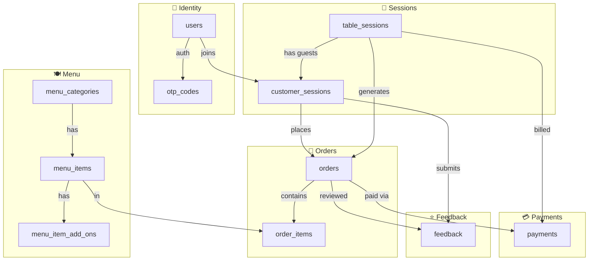

# Tavonza AI — Database Model Diagram

## Entity Relationship Diagram

```mermaid
erDiagram

  %% ══════════════════════════════════════
  %% IDENTITY DOMAIN
  %% ══════════════════════════════════════

  users {
    uuid        id               PK
    text        email            UK "indexed"
    text        password_hash    "bcrypt hashed"
    text        first_name
    text        last_name
    text        phone            "nullable"
    user_role   role             "super_admin|owner|manager|staff|kitchen"
    uuid        organization_id  "nullable, not FK yet"
    boolean     is_active        "default true"
    boolean     is_email_verified "default false"
    text        refresh_token    "nullable, bcrypt hashed"
    timestamp   created_at
    timestamp   updated_at
  }

  otp_codes {
    uuid        id          PK
    uuid        user_id     FK
    text        code        "bcrypt hashed 5-digit"
    text        type        "email_verification|password_reset"
    timestamp   expires_at
    timestamp   used_at     "nullable — null = unused"
    timestamp   created_at
  }

  %% ══════════════════════════════════════
  %% MENU DOMAIN
  %% ══════════════════════════════════════

  menu_categories {
    uuid        id           PK
    uuid        branch_id    "indexed with is_active"
    text        name
    text        description  "nullable"
    text        image_url    "nullable"
    integer     sort_order   "default 0"
    boolean     is_active    "default true"
    timestamp   created_at
    timestamp   updated_at
  }

  menu_items {
    uuid        id               PK
    uuid        branch_id        "indexed"
    uuid        category_id      FK
    text        name
    text        description      "nullable"
    numeric     price            "10,2"
    text        image_url        "nullable"
    integer     prep_time        "nullable, minutes"
    integer     calories         "nullable"
    boolean     is_vegetarian    "default false"
    boolean     is_vegan         "default false"
    boolean     is_gluten_free   "default false"
    text        allergens        "nullable, comma-separated"
    text        wine_pairing     "nullable"
    text        wine_pairing_note "nullable"
    numeric     rating           "2,1 nullable"
    integer     rating_count     "default 0"
    boolean     is_available     "default true"
    boolean     is_popular       "default false"
    integer     sort_order       "default 0"
    timestamp   created_at
    timestamp   updated_at
  }

  menu_item_add_ons {
    uuid        id           PK
    uuid        menu_item_id FK "cascade delete"
    text        name
    numeric     price        "10,2"
    boolean     is_active    "default true"
  }

  %% ══════════════════════════════════════
  %% INVENTORY DOMAIN
  %% ══════════════════════════════════════

  inventory_items {
    uuid        id               PK
    uuid        branch_id        "indexed"
    text        sku_code         UK "per branch"
    text        name
    numeric     on_hand          "10,3"
    numeric     par_level        "10,3"
    text        unit             "kg|L|ea|g"
    text        status           "HEALTHY|LOW_STOCK|CRITICAL|OUT_OF_STOCK"
    timestamp   last_updated_at  "default now"
    timestamp   created_at
  }

  %% ══════════════════════════════════════
  %% ORDER DOMAIN
  %% ══════════════════════════════════════

  orders {
    uuid        id                   PK
    text        order_number         UK "LT-XXXX format"
    uuid        branch_id            "indexed"
    uuid        table_id             "indexed"
    uuid        table_session_id     "nullable FK → table_sessions"
    uuid        customer_session_id  "nullable FK → customer_sessions"
    text        status               "DRAFT|SUBMITTED|ACCEPTED|KITCHEN_QUEUE|PREPARING|READY|SERVED|REJECTED|CANCELLED"
    numeric     subtotal             "10,2 default 0"
    numeric     service_charge_rate  "4,2 default 0.05 (5%)"
    numeric     service_charge       "10,2 default 0"
    numeric     tax_rate             "4,2 default 0.08 (8%)"
    numeric     tax                  "10,2 default 0"
    numeric     total                "10,2 default 0"
    integer     estimated_prep_time  "nullable, minutes"
    timestamp   created_at
    timestamp   updated_at
    timestamp   submitted_at         "nullable"
    timestamp   accepted_at          "nullable"
    timestamp   ready_at             "nullable"
    timestamp   served_at            "nullable"
  }

  order_items {
    uuid        id                    PK
    uuid        order_id              FK "cascade delete"
    uuid        menu_item_id          FK
    text        name                  "denormalized from menu item"
    numeric     unit_price            "10,2"
    integer     quantity              "default 1"
    text        special_instructions  "nullable"
    json        add_ons               "nullable [{name,price}]"
    numeric     add_ons_total         "10,2 default 0"
    numeric     line_total            "10,2"
  }

  %% ══════════════════════════════════════
  %% SESSION DOMAIN
  %% ══════════════════════════════════════

  table_sessions {
    uuid        id                    PK
    uuid        branch_id             "indexed"
    uuid        table_id              "indexed"
    text        table_number          "e.g. Table 08"
    text        status                "active|closed|paying"
    text        share_code            "UK nullable, 6-char for HostGuest"
    timestamp   share_code_expires_at "nullable, 30s window"
    timestamp   opened_at             "default now"
    timestamp   closed_at             "nullable"
  }

  customer_sessions {
    uuid        id               PK
    uuid        table_session_id FK "cascade delete"
    uuid        user_id          "nullable FK → users"
    text        display_name     "nullable, for guest without account"
    text        role             "host|guest"
    text        order_mode       "individual|together"
    timestamp   joined_at        "default now"
    timestamp   left_at          "nullable"
  }

  %% ══════════════════════════════════════
  %% PAYMENT DOMAIN
  %% ══════════════════════════════════════

  payments {
    uuid        id                 PK
    uuid        order_id           FK
    uuid        table_session_id   "nullable FK"
    uuid        customer_session_id "nullable FK"
    text        method             "card|cash|qr|split"
    text        status             "pending|completed|failed|refunded"
    numeric     amount             "10,2"
    text        currency           "default USD"
    text        card_last4         "nullable — NEVER full card"
    text        cardholder_name    "nullable"
    text        transaction_id     "UK nullable, #ID-timestamp-rand"
    json        receipt_data       "{date,time,to,total}"
    timestamp   paid_at            "nullable"
    timestamp   created_at
    timestamp   updated_at
  }

  %% ══════════════════════════════════════
  %% FEEDBACK DOMAIN
  %% ══════════════════════════════════════

  feedback {
    uuid        id                  PK
    uuid        order_id            FK
    uuid        table_session_id    "nullable FK"
    uuid        customer_session_id "nullable FK"
    uuid        user_id             "nullable FK"
    text        rating              "1-5"
    text        comment             "nullable"
    timestamp   submitted_at        "default now"
  }

  %% ══════════════════════════════════════
  %% RELATIONSHIPS
  %% ══════════════════════════════════════

  %% Identity
  users           ||--o{ otp_codes           : "has many"
  users           ||--o{ customer_sessions   : "can join as"

  %% Menu
  menu_categories ||--o{ menu_items          : "contains"
  menu_items      ||--o{ menu_item_add_ons   : "has add-ons"
  menu_items      ||--o{ order_items         : "ordered as"

  %% Orders
  orders          ||--o{ order_items         : "contains"
  table_sessions  ||--o{ orders              : "generates"
  customer_sessions ||--o{ orders            : "places"

  %% Sessions
  table_sessions  ||--o{ customer_sessions   : "has many guests"

  %% Payments
  orders          ||--o| payments            : "paid via"
  table_sessions  ||--o{ payments            : "billed to"
  customer_sessions ||--o{ payments          : "paid by"

  %% Feedback
  orders          ||--o| feedback            : "reviewed in"
  table_sessions  ||--o{ feedback            : "for session"
  customer_sessions ||--o{ feedback          : "submitted by"
  users           ||--o{ feedback            : "left by"
```

---

## Domain Groups

---

## Table Summary

| Table | Domain | Rows (Typical) | Notes |
|---|---|---|---|
| `users` | Identity | Thousands | Staff + customers |
| `otp_codes` | Identity | Transient | Auto-expire in 10 min |
| `menu_categories` | Menu | 5–20 per branch | Sorted by `sort_order` |
| `menu_items` | Menu | 20–200 per branch | Indexed by branch + popular |
| `menu_item_add_ons` | Menu | 2–10 per item | Cascade delete with item |
| `orders` | Orders | Hundreds/day | Status machine validated in app |
| `order_items` | Orders | 1–20 per order | Price denormalized at order time |
| `table_sessions` | Sessions | 1 active per table | Closed after payment |
| `customer_sessions` | Sessions | 1–8 per table session | host + guests (HostGuest) |
| `payments` | Payments | 1 per order | Card last4 only — no PCI risk |
| `feedback` | Feedback | 1 per order | Optional, post-payment |

---

## Key Business Rules

> [!IMPORTANT]
> **Order status machine** — transitions validated in app layer, not DB:
> `DRAFT → SUBMITTED → ACCEPTED → PREPARING → READY → SERVED`
> `Any status → CANCELLED`

> [!NOTE]
> **HostGuest flow** — One `table_session` per active table. First customer = `host`, others = `guest`. Order mode can be `individual` (split bill) or `together` (shared bill).

> [!NOTE]
> **Card security** — Only `card_last4` and `cardholder_name` stored. Full card numbers are **never** persisted. In production, wire a PCI-compliant provider (Stripe tokenization).

> [!TIP]
> **`branch_id` / `table_id`** — Currently UUIDs referenced loosely. Future: add `branches` and `tables` tables to enforce FK constraints and store names/capacity.

---

## Indexes Summary

| Index | Table | Columns | Purpose |
|---|---|---|---|
| `users_email_idx` | users | email | Login lookup |
| `users_org_idx` | users | organization_id | Filter by org |
| `otp_codes_user_type_idx` | otp_codes | user_id, type | OTP validation |
| `menu_categories_branch_active_idx` | menu_categories | branch_id, is_active | Menu screen load |
| `menu_items_branch_category_idx` | menu_items | branch_id, category_id, is_available | Category filter |
| `menu_items_branch_popular_idx` | menu_items | branch_id, is_popular | "Popular right now" |
| `orders_order_number_idx` | orders | order_number | Unique ref lookup |
| `orders_branch_status_idx` | orders | branch_id, status | Waiter dashboard |
| `orders_table_status_idx` | orders | table_id, status | Cart lookup |
| `table_sessions_branch_table_idx` | table_sessions | branch_id, table_id, status | QR scan lookup |
| `table_sessions_share_code_idx` | table_sessions | share_code | Guest join |
| `payments_order_idx` | payments | order_id | Payment for order |
| `payments_transaction_idx` | payments | transaction_id | Receipt lookup |
| `feedback_order_idx` | feedback | order_id | Review lookup |
